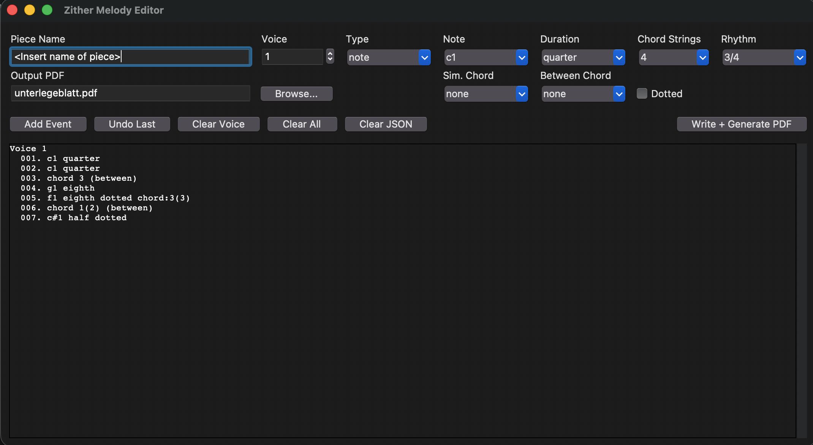
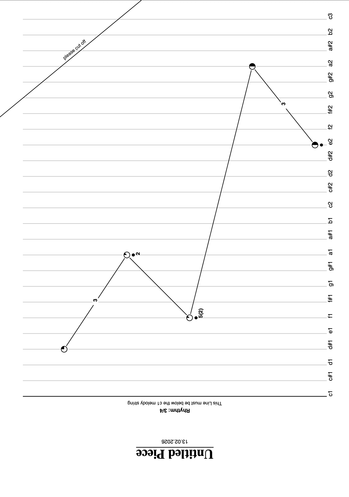

# Zither Unterlegenoten Editor

## Deutsch

Ein simples Desktop-Tool zur Erstellung druckbarer Zither-Unterlegeblätter als PDF.

Die Noten werden in einer GUI Note für Note eingegeben (Noten, Pausen (Experiementell), punktierte Noten, Akkorde) und anschließend direkt als PDF exportiert.
Die Unterlageblätter sind, wenn in DIN A4 format ausgedruckt direkt mit einer 6/25 Zither in Standardstimmung spielbar. 

Disclaimer: Dieses Projekt wurde nur zum Spaß und zum größten Teil mit der Hilfe von KI erstellt und ist nicht für kommerzielle Zwecke geeignet!

### Funktionen

- GUI-basierte Noteneingabe
- Mehrstimmigkeit bis zu vier Stimmen(Stimme 1 immer schwarz, weitere Stimmen farbig)
- Noten, Pausen (Experimentell), punktierte Noten
- Gleichzeitige Akkorde mit Noten 
- Akkorde zwischen Noten
- Akkord-Varianten nach Anzahl gespielter Saiten 

### Voraussetzungen

- Python 3.10+
- reportlab
- Tkinter 

### Ausgabedateien

- Projektdaten: `melody_input.json`
- PDF: in der GUI konfigurierbarer Pfad (`Output PDF`)

### Projektstruktur

- `main.py` - GUI + Rendering-Logik
- `melody_input.json` - gespeicherte Projekteingaben
- `unterlegeblatt.pdf` - erzeugte Ausgabe (oder benutzerdefinierter Pfad)

---

## English

A simple desktop tool for creating printable zither underlay sheets as PDF.

You enter notes event-by-event in a GUI, assign voices, rests, dotted notes, and chords, then export directly to PDF.

When printed on standard DIN A4 paper, the resulting sheets will be directly playable on a standard 6/25 zither

Disclaimer: This Project was cerated just for fun and was largely developed with the help of AI and is not intended to be used commercially!

### Features

- GUI-based note entry 
- Multi-voice support for up to 4 voices (voice 1 always black, additional voices colored)
- Notes, rests (experimental), dotted notes
- Simultaneous chords on notes 
- Chords between notes
- Chord string-count variants
- 
### Requirements

- Python 3.10+
- reportlab
- Tkinter 

### Output Files

- Project data: `melody_input.json`
- PDF: configurable path in GUI (`Output PDF`)

### Project Structure

- `main.py` - GUI + rendering logic
- `melody_input.json` - saved project input
- `unterlegeblatt.pdf` - generated output (or custom path)
